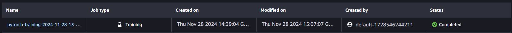
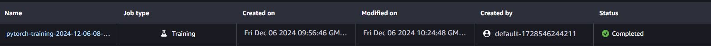
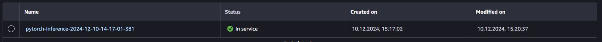
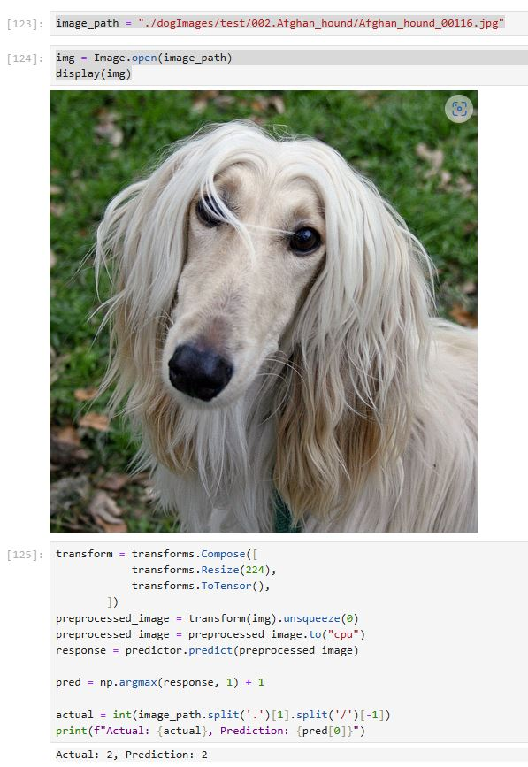

# Image Classification using AWS SageMaker

Use AWS Sagemaker to train a pretrained model that can perform image classification by using the Sagemaker profiling, debugger, hyperparameter tuning and other good ML engineering practices. This can be done on either the provided dog breed classication data set or one of your choice.

## Project Set Up and Installation
Enter AWS through the gateway in the course and open SageMaker Studio. 
Download the starter files.
Download/Make the dataset available. 

## Dataset
The provided dataset is the dogbreed classification dataset which can be found in the classroom.
The project is designed to be dataset independent so if there is a dataset that is more interesting or relevant to your work, you are welcome to use it to complete the project.

### Access
Upload the data to an S3 bucket through the AWS Gateway so that SageMaker has access to the data. 

### Structure of the project
The project contain several files required for model creation, training and deployment:
* hpo.py - used for original model creation with set of hyperparameters to tune (afterwards extended by the debugging and profiling code)
* train_model.py - used for debugger and profiler creation with selected hyperparameters set from previous training based on hpo.py
* deploy_model.py - used for code deployment (originaly I tried to use common file from train and deployment but after getting sevral errors and based on Knowledge Udacity site I decided to seprarate the deployment code)
* train_and_depoy.ipynb - code with overal project configurationa and step by step setup

## Hyperparameter Tuning
What kind of model did you choose for this experiment and why? Give an overview of the types of parameters and their ranges used for the hyperparameter search

I applied a Resnet50 as my pretrained model as it was part of the training lectures and I wanted to verify the use on a real project.
I selected 3 hyperparameters to find the best configurations. These where:
* Learning Rate in range ContinuousParameter(0.01, 0.5)
* Batch-size in range CategoricalParameter([8, 16, 32, 64]),
* Number of Epochs in range IntegerParameter(2, 5)

Remember that your README should:
- Include a screenshot of completed training jobs:
a) Initial training job based on hpo.py file 

b) Final training with selected hyperparameters using the train_model.py


- Logs metrics during the training process: These are include inside train_and_deploy_model.ipynb
- Tune at least two hyperparameters: 3 hyperparameters were chosen for tunning
- Retrieve the best best hyperparameters from all your training jobs: as per train_and_deploy_model.ipynb these are {'batch-size': 16, 'lr': '0.22721942209010104', 'epochs': 3}

The above results were done based on the below estimator code
```
hyperparameter_ranges = {
    "lr": ContinuousParameter(0.01, 0.5),
    "batch-size": CategoricalParameter([8, 16, 32, 64]),
    "epochs": IntegerParameter(2, 5),
}

objective_metric_name = "Accuracy"
objective_type = "Maximize"
metric_definitions = [{"Name": "Accuracy", "Regex": "Test set: Accuracy: ([0-9\\.]+)%"}]

estimator = PyTorch(
    entry_point="hpo.py",
    role=role,
    instance_count=1,
    instance_type="ml.m5.2xlarge",
    framework_version="1.8",
    py_version="py36",
)

tuner = HyperparameterTuner(
    estimator,
    objective_metric_name,
    hyperparameter_ranges,
    metric_definitions,
    max_jobs=1,
    max_parallel_jobs=1,
    objective_type=objective_type,
)

tuner.fit({"training": inputs}, wait=True)
```


## Debugging and Profiling
**TODO**: Give an overview of how you performed model debugging and profiling in Sagemaker
To create debugging anf profiling data I installed and imported the smdebug module. Then setup hooks inside the training script. Then in the the Jupyter Notebook file  I created debugger and profiler configurations. 
```
rules = [
    Rule.sagemaker(rule_configs.vanishing_gradient()),
    Rule.sagemaker(rule_configs.overfit()),
    Rule.sagemaker(rule_configs.overtraining()),
    Rule.sagemaker(rule_configs.poor_weight_initialization()),
    ProfilerRule.sagemaker(rule_configs.ProfilerReport()),
    ProfilerRule.sagemaker(rule_configs.LowGPUUtilization()),
]

profiler_config = ProfilerConfig(
    system_monitor_interval_millis=500, framework_profile_params=FrameworkProfile(num_steps=10)
)

debugger_config = DebuggerHookConfig(
    hook_parameters={"train.save_interval": "100", "eval.save_interval": "10"}
)
```


Then I fit dog images data to the estimator model with selected best hyperparameters.
```
estimator_deb = PyTorch(
    entry_point="train_model.py",
    role=role,
    instance_count=1,
    instance_type="ml.m5.2xlarge",
    framework_version="1.8",
    py_version="py36",
    hyperparameters=hyperparameters,
    profiler_config=profiler_config,
    debugger_hook_config=debugger_config,
    rules=rules,
)
```

### Results
**TODO**: What are the results/insights did you get by profiling/debugging your model?
**Debugger**: Revealed PoorWeightInitialization issue.
**Profiler** Revealed existence of several outliers in the dataset

Profiler report available here: [Report](./profiler-report.html)

**TODO** Remember to provide the profiler html/pdf file in your submission.
Added to the project code as profiler-report.html

## Model Deployment
**TODO**: Give an overview of the deployed model and instructions on how to query the endpoint with a sample input.
- The Sagemaker estimator model is deployed to a sagemaker maker endpoint on machine of instance-type: ml.m5.xlarge using deploy_model.py


- The images can be send to the estimator created by the below code
```
model = PyTorchModel(
    model_data=model_data,
    role=role,
    entry_point="deploy_model.py",
    py_version='py36',
    framework_version="1.8"
)

predictor = model.deploy(
    initial_instance_count=1, 
    instance_type="ml.m5.xlarge"
)
```
The example prediction is visible below

