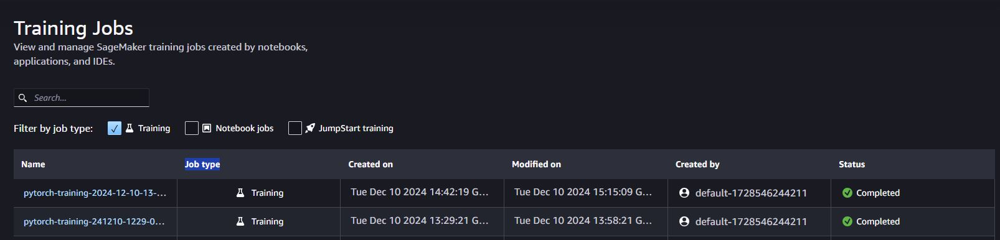

# Image Classification using AWS SageMaker

Use AWS Sagemaker to train a pre-trained model that can perform image classification by using the Sagemaker profiling, debugger, hyperparameter tuning and other good ML engineering practices. This can be done on either the provided dog breed classification data set or one of your choice.

## Project Set Up and Installation
Enter AWS through the gateway in the course and open SageMaker Studio. 
Download the starter files.
Download/Make the dataset available. 

## Dataset
The provided dataset is the dog breed classification dataset which can be found in the classroom.
* It images of dogs of different breeds.
* There are 133 classes of dog breeds available.
* The Dataset is split into three directories train, validation and testing.
* Each Directory has 133 sub directories, one directory per dog breed class.

### Access
Upload the data to an S3 bucket through the AWS Gateway so that SageMaker has access to the data. 

### Structure of the project
The project contain several files required for model creation, training and deployment:
* `hpo.py` - used for original model creation with set of hyperparameters to tune (afterwards extended by the debugging and profiling code)
* `train_model.py` - used for debugger and profiler creation with selected hyperparameters set from previous training based on hpo.py
* `deploy_model.py` - used for code deployment (originally I tried to use common file from train and deployment but after getting sevral errors and based on Knowledge Udacity site I decided to seprarate the deployment code)
* `train_and_depoy.ipynb` - code with overall project configuration and step by step setup

## Hyperparameter Tuning
What kind of model did you choose for this experiment and why? Give an overview of the types of parameters and their ranges used for the hyperparameter search

A pretrained Resnet50 model was used for this project.

I selected 3 hyperparameters to find the best configurations. These where:
* `Learning Rate in range ContinuousParameter(0.001, 0.1)` - it usually has small values based on a log scale. It affects the peed of training and if appropriate does not cause the learning process to diverge.
* `Batch-size in range CategoricalParameter([32, 64, 128])` - it affects the speed of training and accuracy. With higher batch size we get more stable results but the speed of training deteriorates
* `Number of Epochs in range IntegerParameter(1, 3)` - it represents the number of trainings done with the selected model, high number can cause overfitting

Remember that your README should:
- Include a screenshot of completed training jobs:
* Training job based on `hpo.py` and `train_model.py` file were completed successfully


- Logs metrics during the training process: These are include inside `train_and_deploy_model.ipynb`
- Tune at least two hyperparameters: 3 hyperparameters were chosen for tunning
- Retrieve the best best hyperparameters from all your training jobs: as per `train_and_deploy_model.ipynb` these are {'batch-size': 128, 'lr': '0.008328295873680674', 'epochs': 3}

The above results were done based on the below estimator code
```
hyperparameter_ranges = {
    "lr": ContinuousParameter(0.001, 0.1),
    "batch-size": CategoricalParameter([32, 64, 128]),
    "epochs": IntegerParameter(1, 3),
}

objective_metric_name = "Accuracy"
objective_type = "Maximize"
metric_definitions = [{"Name": "Accuracy", "Regex": "Test set: Accuracy: ([0-9\\.]+)%"}]

estimator = PyTorch(
    entry_point="hpo.py",
    role=role,
    instance_count=1,
    instance_type="ml.c5.2xlarge",
    framework_version="1.8",
    py_version="py36",
)
tuner = HyperparameterTuner(
    estimator,
    objective_metric_name,
    hyperparameter_ranges,
    metric_definitions,
    max_jobs=1,
    max_parallel_jobs=1,
    objective_type=objective_type,
)

tuner.fit({"training": inputs}, wait=True)
```


## Debugging and Profiling
- **Debugging** captures the tensor values as they go through training and evaluation phase of the process
- **Profiling** captures model metrics like CPU and GPU utilization, outliers, bottlenecks and other statistics

### Steps done to apply model debugging and profiling
- Install and import the smdebug module. 
- Setup hooks inside the training script (train inside training function and eval inside validation and testing) 
- Register the hook in the model to get the tensors and track the loss function
- Created debugger and profiler configurations in Jupyter Notebook. 
- Run the model with the created configurations ad retrieve final reports

```
rules = [ 
    Rule.sagemaker(rule_configs.loss_not_decreasing()),
    ProfilerRule.sagemaker(rule_configs.ProfilerReport())
]

profiler_config = ProfilerConfig(
    system_monitor_interval_millis=500, framework_profile_params=FrameworkProfile(num_steps=10)
)

collection_configs=[
    CollectionConfig(
        name="weights",
        parameters={
            "train.save_interval": "5",
            "eval.save_interval": "1"
        }
    ),
    CollectionConfig(
        name="gradients",
        parameters={
            "train.save_interval": "5",
            "eval.save_interval": "1"
        }
    ),
    CollectionConfig(
        name="biases",
        parameters={
            "train.save_interval": "5",
            "eval.save_interval": "1"
        }
    ),
    CollectionConfig(
        name="CrossEntopyLoss_output_0", 
        parameters={
            "include_regex": "CrossEntropyLoss_output_0",
            "train.save_interval": "1",
            "eval.save_interval": "1"
        }
    )
]

debugger_config = DebuggerHookConfig(
    hook_parameters={
        "train.save_interval": "5",
        "eval.save_interval": "1"
    },
    collection_configs=collection_configs
)

estimator_deb = PyTorch(
    entry_point="train_model.py",
    role=role,
    instance_count=1,
    instance_type="ml.m5.2xlarge",
    framework_version="1.8",
    py_version="py36",
    hyperparameters=hyperparameters,
    profiler_config=profiler_config,
    debugger_hook_config=debugger_config,
    rules=rules,
)
```

### Results
Below graph represents the training loss values captured during the model training and validation process:
['loss_graph'](./loss__graph.jpeg)

**Insights from the plot**
- The training loss initially increases within small number of steps but then significantly decreases with the higher number of steps.
- The validation loss seems to be quite stable but quite noisy

**TODO**: What are the results/insights did you get by profiling/debugging your model?

* **Debugger**: Revealed PoorWeightInitialization issue.
* **Profiler** Revealed existence of several outliers in the dataset

**TODO** Remember to provide the profiler html/pdf file in your submission.

Profiler report available here: [Report](./profiler-report.html)

## Model Deployment
**TODO**: Give an overview of the deployed model and instructions on how to query the endpoint with a sample input.

- The deployed model is a ResNet50 pretrained model with the finetuned parameters
- Model takes and image of size (3, 224, 224) as an input and outputs 133 values representing the dog breeds in the dataset
- The model was finetuned for 3 epochs using a batch size of 128 and learning rate ~0.008.
- The Sagemaker estimator model is deployed to a SageMaker endpoint on machine of instance-type: ml.m5.xlarge using deploy_model.py


- The images can be send to the estimator created by the below code
```
model = PyTorchModel(
    model_data=model_data,
    role=role,
    entry_point="deploy_model.py",
    py_version='py36',
    framework_version="1.8"
)

predictor = model.deploy(
    initial_instance_count=1, 
    instance_type="ml.m5.xlarge"
)
```
- The example prediction is visible below
  

